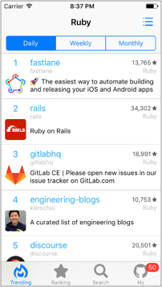
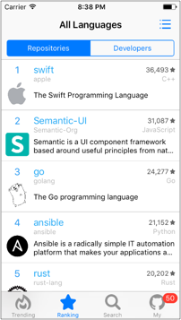
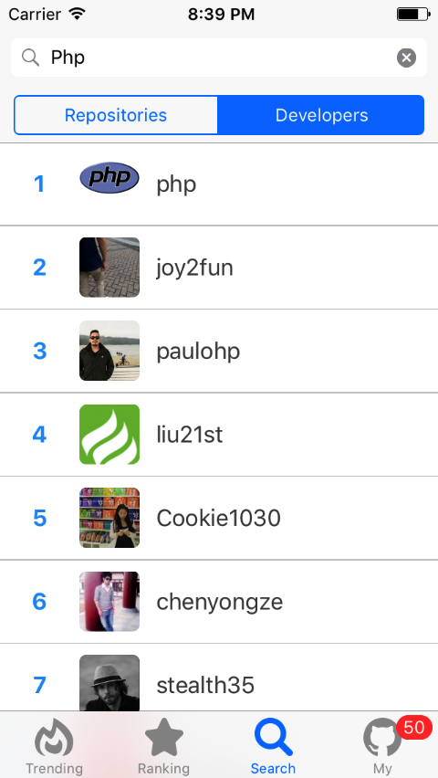
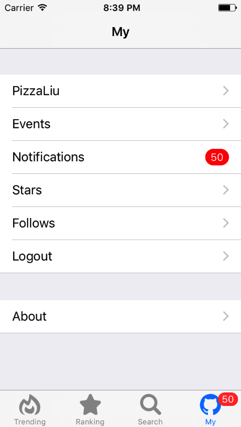
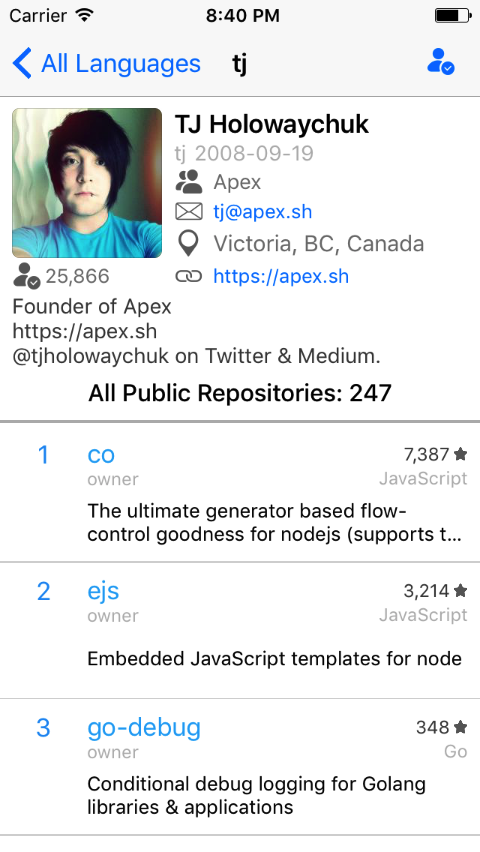
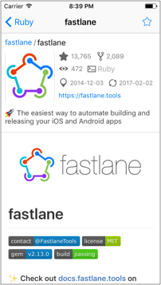

# PigHub

A lite GitHub explorer of iOS.

## How to get it

Download from App Store: https://itunes.apple.com/cn/app/pighub/id1202177372

or just search `PigHub` in App Store.

## How to build it

0. Get yourself a github api OAuth `Client ID` and `Client Secret` [here](https://github.com/settings/applications/new).
1. Clone this project to your disk: `$ git clone https://github.com/PizzaLiu/PigHub.git`.
2. Install dependencies in project root folder: `$ pod install`.
3. Put `Client ID` and `Client Secret` in `PigHub/Common/General/AppConfig.sample.h` and rename it to `PigHub/Common/General/AppConfig.h`
4. Open in latest Xcode (>=Xcode 8.2) then `Command` + `B` to build it.

## Screenshots

-------------

## Why is it called PigHub?

`PizzaLiu` + `GitHub` ~> `PizzaLiuGitHub` ~> `PitHub` ~> `PigHub`

## Todo

- [ ] Add gist module.
- [ ] Add notification push.
- [ ] Replace WebView in Repo Detail View to rendering markdown contents from api.
- [ ] Support spotlight.
- [ ] New app icon.

## Contributing

Contributors are more than welcome. Just upload a PR with a description of your changes.

If you would like to add more feature modules feel free to do so!

## Icons Copyrights

 by arejoenah
 by AlePio
 by Dan Jenkins
 by carlos gonzalez
 by carlos gonzalez
 by Nick Bluth
 by Luis Rodrigues
 by Lloyd Humphreys
 by Xinh Studio
 by Maxim Kulikov
 by Viktor Vorobyev
 by Kimmi Studio
 by Bluetip Design
 by Yasir B. Eryılmaz
 by Mahmure Alp
 by Nick Bluth
 by Amr Fakhri
 by Sofía Moya

> All is under Creative Commons Attribution license.
> Thanks to [thenounproject.com](https://thenounproject.com)

## Licenses

All source code is licensed under the MIT License.
